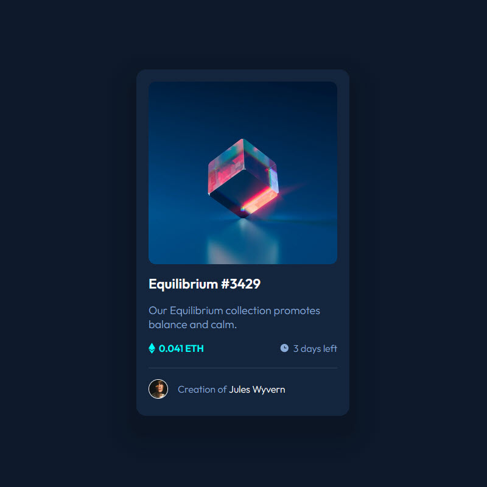

## Frontend Mentor - NFT preview card component

View this project here: [NFT preview card component](https://rorymcpherson.github.io/frontend-mentor/nft-preview-card-component/index.html)

### Built with

- Semantic HTML5 markup
- CSS custom properties

###

This is a solution to the [Blog preview card challenge on Frontend Mentor](https://www.frontendmentor.io/challenges/nft-preview-card-component-SbdUL_w0U).

Find me on Frontend Mentor [@rorymcpherson](https://www.frontendmentor.io/profile/rorymcpherson).