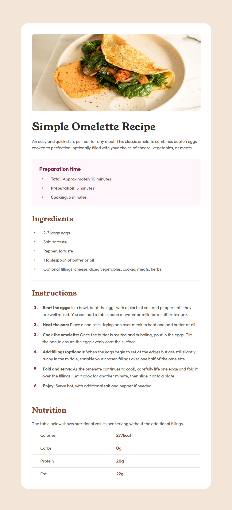

## Recipe Page | Frontend Mentor

View this project here: [Recipe Page](https://rorymcpherson.github.io/frontend-mentor/recipe-page/index.html)

### Built with

- Semantic HTML5 markup
- CSS custom properties
- Responsive design and media queries

###

This is a solution to the [Recipe Page](https://www.frontendmentor.io/challenges/recipe-page-KiTsR8QQKm) challenge on Frontend Mentor.

Find me on Frontend Mentor at [@rorymcpherson](https://www.frontendmentor.io/profile/rorymcpherson)